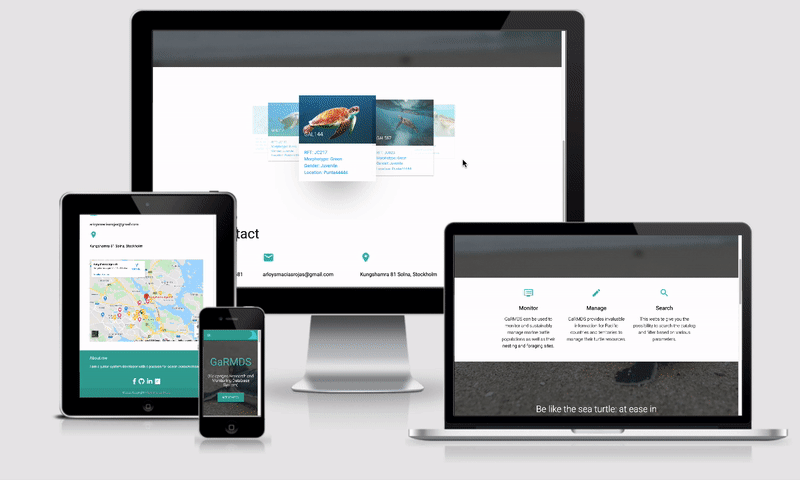
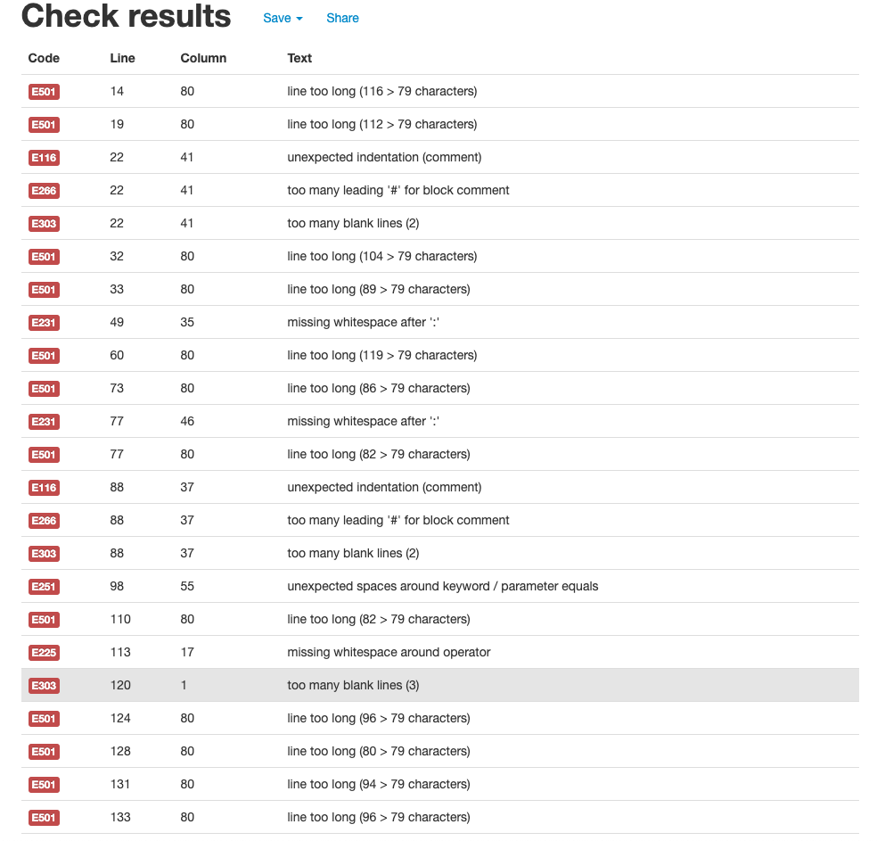
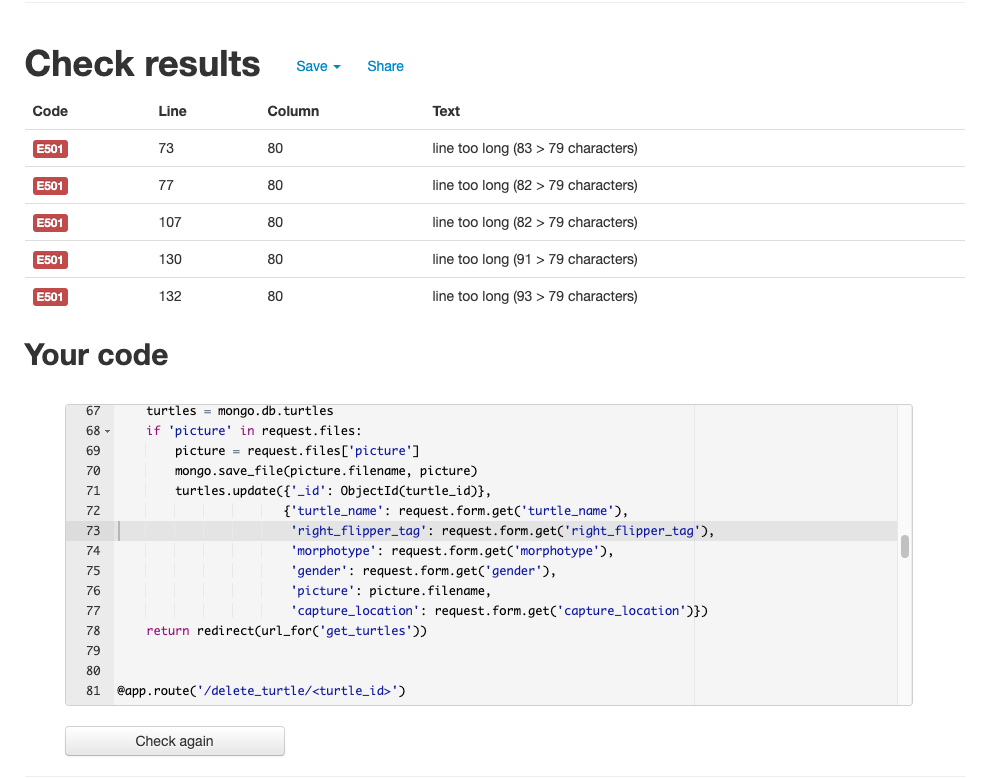
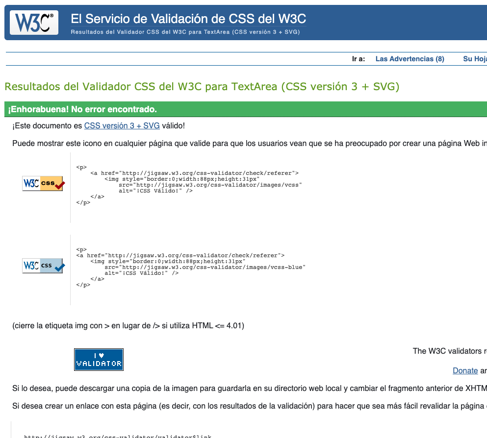
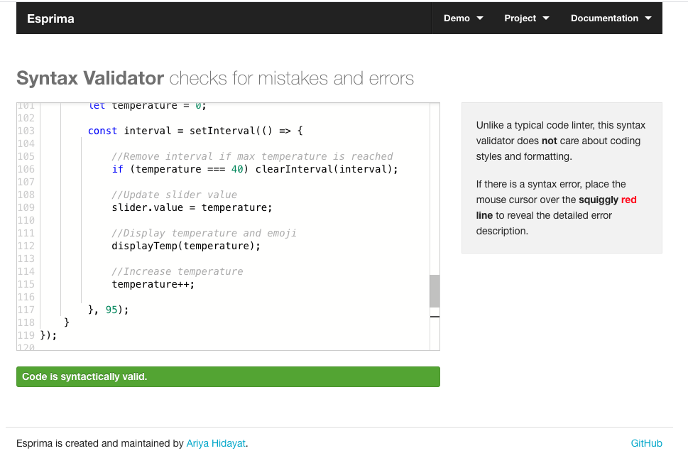

# Galapagos Research and Monitoring Database System (GaRMDS)
This is my 3rd milestone project with Code Institute and their Full Stack Web Developer course.

## Table of Contents
- [Demo](#demo)
- [Summary](#summary)
  * [Project purpose:](#project-purpose-)
- [UX](#ux)
  * [User Stories:](#user-stories-)
  * [Design and Colors](#design-and-colors)
    + [Colors](#colors)
    + [Fonts](#fonts)
    + [Wireframes](#wireframes)
      - [Final wireframes:](#final-wireframes-)
- [Features](#features)
  * [Existing Features](#existing-features)
  * [Features Left to Implement](#features-left-to-implement)
- [Technologies](#technologies)
  * [Languages](#languages)
  * [Frameworks Editors and Version Control](#frameworks-editors-and-version-control)
  * [Tools Used](#tools-used)
- [Testing](#testing)
  * [Unit tests](#unit-tests)
    + [PHP Validation](#php-validation)
    + [CSS Validation](#css-validation)
    + [HTML Validation](#html-validation)
    + [JavaScrip Validation](#javascrip-validation)
  * [Functional tests](#functional-tests)
  * [Browser Compatibility test](#browser-compatibility-test)
  * [Defensive design](#defensive-design)
- [Deployment](#deployment)
  * [Cloning your repository to create local copy](#cloning-your-repository-to-create-local-copy)
  * [Deploy to heroku](#deploy-to-heroku)
- [Credits](#credits)

## Demo

## Summary 

My wife is a marine biologist who has worked with sea turtles in Galapagos. In their conservation work they collect data from hundreds of individuals with the purpose to monitor the sea turtle population. The field work is challenging, where the standard method is to note on paper and later, in the lab, enter the data into a spreadsheet which leads to data being lost or mixed up during entry. Because of this a simple input method is needed where data can be entered instantly and on site.

### Project purpose: 

The purpose of this project is to build a full-stack site that allows turtle conservationists to manage a common dataset about sea turtle populations in the Pacific.

Value provided:

The application allows users to monitor and sustainably manage marine turtle populations as well as their nesting and foraging sites. It provides invaluable information for Pacific countries and territories to manage their turtle resources as well as search the catalog and filter based on various parameters.

## UX

### User Stories:
* As a user I want to be able to search for individual turtles that already exist in the database.

* As a user I want to be able to contact the administrator of the site.

* As a user I want to be able to add my own turtle data to the database.

* As a user I want be able to edit existing data on turtle individuals.

* As a user I want to be able to delete existing data on turtle individuals.

### Design and Colors

#### Colors

*  #FFFFFF - Primary background color

*  #5A9DB4 - Button hover color, Form input field label color, Datepicker hover color

#### Fonts

For all fonts I used Roboto, from Google Fonts. This font works well with the design as it is modern and simple. > Roboto has a dual nature. It has a mechanical skeleton and the forms are largely geometric. - [[Google Fonts, 2020]](https://fonts.google.com/specimen/Roboto).

#### Wireframes

I wanted to have a table with pagination using Material Design for Bootstrap but it became very cumbersome since the css and scripts overlapped and confronted those of Materialize so in the end I decided to use the materialize parallax template where the background image is moved at a different speed than the foreground content while scrolling.

##### Final wireframes:

[Mobile view](https://github.com/ArloysMacias/Sea-Turtle-Catalogue/blob/main/static/images/wireframes/Mobile%20Wireframe.png)

[Desktop and tablet view](https://github.com/ArloysMacias/Sea-Turtle-Catalogue/blob/main/static/images/wireframes/Desktop%20Wireframe.png)

[Back to Top](#table-of-contents))

## Features

### Existing Features

* Header: Allows user to know the name of the project as well as understanding what it is.

* Carousel cards: Allows users a sneak peek of the catalogue. It also allows the user to quickly edit an individual by clicking on it.

* Features: Lets read the main features and practical value of the website

* Turtles page: Allows users to create read update and delete (CRUD) individuals from the database

* Footer: Allows the user to see copyright, date of project completion and author. 

### Features Left to Implement

This database may get extensive in the future, so it would be convenient to implement some filters that allow for basic and fast queries with the purpose of finding an individual quickly without the need to search the entire database.

[Back to Top](#table-of-contents)

## Technologies

### Languages
* [HTML5](https://html.spec.whatwg.org/multipage/)
    * A markup language that it is used for structuring and presenting content. 
* [CSS](https://www.w3.org/Style/CSS/)
    * The language for describing the presentation of Web pages. The project uses it for including colors, layout, and fonts.
* JavaScript
    * Used to make web development easier and more attractive.
 
### Frameworks Editors and Version Control
* [Boostrap](https://getbootstrap.com/)
    * A front-end helper with a free collection of tools that is used to design and customize a responsive layout to the project.
* [Materialize](https://materializecss.com/)
    * Is an open source responsive front-end framework that offers slick material design out-of-the-box. The project used the parallax template to get the background to move at a different speed than the foreground content. But also for structuring layout, button styling and responsive navigation bar.
* [Flask](https://flask.palletsprojects.com/en/1.1.x/quickstart/#debug-mode) 
    * A framework that lets you create web applications quickly. The project used Flask framework to compile modules and libraries.
* [JQuery](https://jquery.com/)
    * The project uses JQuery to simplify DOM manipulation.
* [Flask-PyMongo](https://flask-pymongo.readthedocs.io/en/latest/)
    * Used to bridge Flask and PyMongo and provides some convenience helpers.
* [Git](https://git-scm.com/doc)
    * Used for tracking changes in the code during software development.
* [GitHub](https://github.com/) 
    * A Git repository hosting service which provides a Web-based graphical interface and is also used to trigger deployments.
* [IntelliJ IDEA](https://www.jetbrains.com/es-es/idea/)
    * An integrated development environment (IDE) written in Java. It it is used for developing and coding. 
    
### Tools Used
* [MongoDB](https://www.mongodb.com/)
    * Is used to store the database in the cloud.
* [Font Awesome](https://fontawesome.com/) 
    * The project uses it to get vector icons and social logos.
* [Google Fonts](https://fonts.google.com/) 
    * The project uses it to get elegant fonts without compromising users’ privacy or security.
* [Drawio](https://app.diagrams.net/)
    * A streamlined web app that was used to create diagrams. It was used to create the project mockups.
* [Favicon Generator](https://www.favicon-generator.org/)
    * Used to find the right Favicon for the project.    
* [Canva photos](https://www.canva.com/photos/)
    * Used to find the background images.     
* [W3C Validator](https://validator.w3.org/)
    * Used to check the validity of my HTML and CSS. 
* [PEP 8 Online Validator](http://pep8online.com/)
    * Used to check the Python code.
    
[Back to Top](#table-of-contents)

## Testing

This site was tested with the inspection function of Chrome and Firefox and the featured mobile view that they provide (iphone 6, 7, 8 plus and ipad). No issues were detected during the testing. Neither were any issues found when tests were performed in devices with high contrast.

I used [W3C Validator](https://validator.w3.org/) to check the markup validity of Web documents in HTML and CSS. Highlighted errors:

### Unit tests

#### PHP Validation
Before

After

#### CSS Validation
I used [W3C Validator](https://jigsaw.w3.org/css-validator/validator) to check myscript.js, the code was syntactically valid:

#### HTML Validation
Before:

After:

#### JavaScrip Validation

I used [Esprima](https://esprima.org/demo/validate.html) Syntax Validator to check myscript.js, the code was syntactically valid:

### Functional tests

|   Scenario  |        Test      |    Actual Result  |  Pass/Fail  |     Comments     |
| ------------|:----------------:| :----------------:| :----------:| :---------------:|
|User opens the project| Logo takes user to Home page | Home page is accessed | Pass | This works on every page of the project
|       | The carousel loads with individuals | The carousel shows the individuals in the database | Pass | Only 5 individuals will be visible at one time
|    | The carousel doesn't load individuals | The carousel doesn't show | Pass | This happens when the database is empty
|    | User clicks on "Get started" | User is directed to the turtle catalogue | Pass |
|    | "Home" takes user to Home page | Home page is accessed | Pass | This works on every page of the project 
|    | User clicks on "New Turtle" | User is directed to the turtle editor | Pass | This works on every page of the project 
|    | User clicks on "Manage Capture" | User is directed to the capture editor | Pass | This works on every page of the project 
| User adds a new turtle | Turtle data is inserted into database | The page indicates that the data is uploading | Pass | Loading time depends on image size
| User edits an existing turtle | Data to edit is displayed | All the fields are filled with existing data to edit | Pass | The recapture switch is not implemented yet
| User deletes a turtle | Turtle data is deleted | Turtle data is deleted | Pass |
| User adds a new capture| Capture data is inserted into database | The page indicates that the data is uploading | Pass | 
| User edits an existing capture | Data to edit is displayed | All the fields are filled with existing data to edit | Pass | 
| User deletes a capture | Capture data is deleted | Capture data is deleted | Pass | The cascade delete function is not applicable for this business logic

### Browser Compatibility test

| Browser       | Name | Pass/Fail |
|:-------------:| :---------------: | :-----:|
|  | Chrome | Pass |
|  | Safari| Pass |
|  | Firefox| Pass |

### Defensive design
For the moment, the project is created for a closed group of researchers working in the Galapagos. And for that reason, no admin credentials are needed to access and handle (create, edit, delete) the database.
   
[Back to Top](#table-of-contents)

## Deployment

The project was created with IntelliJ and the site is hosted by GitHub. Different branches were used, each one with various commits, named depending on their long-term purpose and changed characteristic respectively. Several pull requests were created once the branch's purpose was fulfilled. It was used the master branch which allows every change, commit and push to show immediately in real time to users.

### Cloning your repository to create local copy

* Select the [Repository](https://github.com/ArloysMacias/Near)

* Click on the 'Clone or Download' button

* Copy the URL provided

* Open terminal (Mac) / Open Git Bash (Windows) 

* Find the directory you want to clone the repository to

* Type `git clone` and paste the URL, press Enter

* Your local clone has be created

### Deploy to heroku

* On Heroku create an account and log in.
* Click `new` and `create new app`.
* Choose a unique name for your app, select region and click on `Create App`
* Under the `Settings` click `Reveal Config Vars` and set IP to 0.0.0.0 and the PORT to 5000
* Go to the CLI and type `$ sudo snap install --classic heroku`
* Type `$ heroku login` command into the terminal
* Create `requirements.txt` ($ sudo pip3 freeze --local > requirements.txt)
* Create a `Procfile` (`$ echo web: python app.py > Procfile`)
* Go back to Heroku, under `Deploy` find `Existing Git repository` and copy the command:`$ heroku git:remote -a <app_name>` Paste this into the terminal.
* (If repository was not created already, type:
* `$ cd my-project/`
* `$ git init`
* `$ heroku git:remote -a <app_name>`)
* Type `$ heroku ps:scale web=1` into the terminal.
* Go back to Heroku, and at `Settings` copy `https://<app_name>.herokuapp.com/` 
* In the terminal type `git remote add http://<app_name>.herokuapp.com/`
* Type `git push -u heroku master`
* In the app dashboard, under `Settings` click on `Reveal Config Vars`
* Set "MONGO_URI" and "MONGO_DBNAME" and "SECRET_KEY"
* Once the build is complete, go back to Heroku and click on `Open App`

## Credits

Thanks to my mentor who supported me and came with good ideas and thanks to my wife who put up with me during this time.

[Back to Top](#table-of-contents)